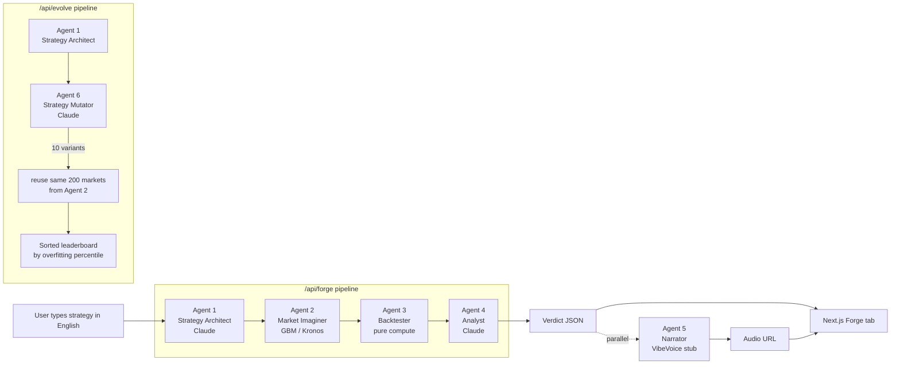

# ARCHITECTURE

## System overview

QuantForge is a six-agent AI pipeline wrapped in a FastAPI backend and a Next.js 15 frontend. Agents are plain Python modules with typed function signatures. The orchestrator is a thirty-line file that calls agents in sequence. There is no `BaseAgent` class, no message bus, no retry framework. Each agent has one job, and the glue that connects them is ordinary function composition.

## The six agents



### Agent 1: Strategy Architect

**File:** `backend/agents/strategy_architect.py`
**Signature:** `async def architect(description: str) -> StrategyCode`
**Model:** Anthropic Claude (`claude-opus-4-6` by default)

Converts a plain-English strategy description into a typed Python function. The system prompt constrains the output to a function with the exact signature `def strategy(df: pd.DataFrame) -> pd.Series`, using only pandas, numpy, and standard library. All indicators (RSI, MACD, Bollinger Bands, moving averages) are implemented from scratch so the output does not depend on external trading libraries that may not be installed.

The returned code is validated by parsing it into an AST, confirming the function signature, and raising `StrategyParseError` on any mismatch. Invalid outputs are never passed to the Backtester.

### Agent 2: Market Imaginer

**File:** `backend/agents/market_imaginer.py` (primary), `market_imaginer_kronos.py` (alternate)
**Signature:** `async def imagine(asset: str, n_scenarios: int = 200) -> list[MarketCandles]`
**Generator:** GBM (primary, v1), Kronos (alternate, v2 primary)

Takes an asset ticker, returns N synthetic OHLCV sequences. The primary generator in v1 is a Geometric Brownian Motion process calibrated to the historical volatility of the real asset. The alternate generator wraps Kronos-mini (4M params, MIT license) in a typed module with mock-based tests so that the Kronos path is visible in the architecture without being an import-time risk when weights are absent.

Calling `imagine("SPY", 200)` returns a list of 200 synthetic market histories, each a pandas DataFrame with `open`, `high`, `low`, `close`, `volume` columns indexed by timestamp. The markets are strategy-agnostic, which matters for the Evolve flow: we generate markets once and reuse them across ten mutated variants.

### Agent 3: Backtester

**File:** `backend/agents/backtester.py`
**Signature:** `def backtest(code: StrategyCode, markets: list[MarketCandles], real_market: MarketCandles) -> BacktestResult`
**Model:** none, pure compute

The only agent that does not call a model. Takes the strategy code, the synthetic markets, and the real market. Runs the strategy against every market via `safe_exec`, computes equity curves, Sharpe, max drawdown, probability of ruin, and the overfitting percentile. Returns a `BacktestResult` pydantic model with all metrics.

`safe_exec` runs the user-provided strategy code in a multiprocessing subprocess with a five-second timeout, terminating the subprocess on timeout. This defends against infinite loops in generated code without using `signal.alarm`, which does not work under FastAPI because signals only fire on the main thread and uvicorn request handlers do not run there.

### Agent 4: Analyst

**File:** `backend/agents/analyst.py`
**Signature:** `async def analyze(result: BacktestResult) -> Verdict`
**Model:** Anthropic Claude

Takes the raw metrics from the Backtester and writes a three-to-four-sentence verdict in plain English. The prompt grounds Claude in the actual numbers and instructs it to explain the statistical meaning, not just recite the values. Example output:

> Your strategy returned 40% on real SPY data, but in 873 out of 1,000 alternative histories it lost money. Your real-history result sits at the 97th percentile of synthetic outcomes, meaning your backtest looks like an outlier rather than a reliable edge. The 18% probability of ruin under synthetic stress suggests the strategy depends heavily on one specific regime and is not robust to realistic market variation.

### Agent 5: Narrator

**File:** `backend/agents/narrator.py`
**Signature:** `async def narrate(verdict_text: str) -> AudioURL`
**Model:** VibeVoice-1.5B (MIT license, ICLR 2026) — stub in v1, live in v2

Takes the verdict text and returns a URL the frontend can play. The v1 implementation returns a pre-recorded stub per preset strategy. The v2 implementation synthesizes fresh audio via VibeVoice. The endpoint is `/api/narrate`, called in parallel with `/api/forge` so audio finishes loading while the chart animation plays. There is no sequential blocking on audio.

### Agent 6: Strategy Mutator

**File:** `backend/agents/mutator.py`
**Signature:** `async def mutate(original: StrategyCode) -> list[StrategyCode]`
**Model:** Anthropic Claude

Only active in the Evolve flow. Takes a baseline strategy and produces ten parametric or structural variants. Each variant enters the pipeline at Agent 3 (Backtester), critically reusing the same 200 markets generated by Agent 2 for the baseline strategy. Markets are strategy-agnostic, so Kronos (or GBM) is called once per Evolve run regardless of how many variants are in play. This is what makes Evolve cheap.

## The orchestrator

**File:** `backend/orchestrator.py`

A thirty-line file. No classes. No decorators. No framework. Two async functions that call agents in sequence:

```python
async def forge(description: str, asset: str = "SPY") -> ForgeResult:
    code    = await architect(description)
    markets = await imagine(asset, n_scenarios=200)
    real    = load_real_market(asset)
    result  = await asyncio.to_thread(backtest, code, markets, real)
    verdict = await analyze(result)
    return ForgeResult(code=code, result=result, verdict=verdict)

async def evolve(description: str, asset: str = "SPY") -> EvolveResult:
    original = await architect(description)
    variants = await mutate(original)
    markets  = await imagine(asset, n_scenarios=200)
    real     = load_real_market(asset)
    results  = [
        await asyncio.wait_for(
            asyncio.to_thread(backtest, v, markets, real),
            timeout=4.0,
        )
        for v in variants
    ]
    ranked  = sorted(results, key=lambda r: r.overfitting_percentile)
    verdict = await analyze(ranked[0])
    return EvolveResult(variants=variants, results=ranked, verdict=verdict)
```

The backtest call is offloaded to a thread with `asyncio.to_thread` so the event loop stays free. Per-variant timeouts cap the Evolve flow at 4 seconds per variant, preventing a single hanging variant from blocking the pipeline.

## The FastAPI layer

**File:** `backend/main.py`

Three endpoints, all thin wrappers over the orchestrator:

| Method | Path           | Body                             | Returns         |
|--------|----------------|----------------------------------|-----------------|
| POST   | `/api/forge`   | `ForgeRequest { description, asset? }` | `ForgeResult`   |
| POST   | `/api/evolve`  | `EvolveRequest { description, asset? }` | `EvolveResult`  |
| POST   | `/api/narrate` | `NarrateRequest { verdict_text }`       | `AudioURL`      |
| GET    | `/api/health`  | —                                | `HealthStatus`  |

CORS is explicitly configured to accept the frontend origin from `QUANTFORGE_CORS_ORIGINS` env var. Wildcard `*` is disallowed in production config. Every endpoint validates the request body via pydantic before reaching the orchestrator. Every endpoint catches custom exceptions (`StrategyParseError`, `BacktestError`, `StrategyTimeout`, `ModelUnavailable`) and maps them to appropriate HTTP status codes.

## Data flow

1. User types a strategy in the frontend text box and clicks Forge.
2. Frontend posts `{ description, asset: "SPY" }` to `/api/forge`.
3. FastAPI validates the request and calls `orchestrator.forge()`.
4. Agent 1 (Architect) calls Claude, parses the returned Python, validates the signature.
5. Agent 2 (Imaginer) loads the real market history for SPY, calibrates GBM volatility, samples 200 synthetic market paths.
6. Agent 3 (Backtester) runs the strategy against each synthetic path via `safe_exec`, computes metrics per path, aggregates into `BacktestResult` with percentile bands and distributions.
7. Agent 4 (Analyst) calls Claude with the metrics, receives a verdict string.
8. Orchestrator returns `ForgeResult` to the FastAPI layer, which serializes it to JSON.
9. Frontend receives the JSON, renders the fan chart, histograms, gauges, and verdict text.
10. Frontend fires `/api/narrate` in parallel with verdict text, receives audio URL, loads audio while chart animation completes.

Total wall-clock time: ~15 seconds on a warm backend. Kronos model weights are warm-cached at server boot to avoid cold-start penalty on the first real request.

## Technology choices

| Concern              | Choice                  | Reason |
|----------------------|-------------------------|--------|
| Backend framework    | FastAPI                 | Async-native, pydantic-integrated, typed |
| Backend validation   | Pydantic v2             | Runtime types, fast, ecosystem-default |
| Backend settings     | pydantic-settings       | Env-driven config with typed access |
| Backend logging      | structlog               | Structured JSON logs, easy to grep |
| Backend testing      | pytest + hypothesis     | Property tests on GBM, known-input-known-output on Backtester |
| Backend types        | mypy strict             | Non-negotiable, caught real bugs in dev |
| Frontend framework   | Next.js 15 App Router   | Type-safe routing, RSC where helpful |
| Frontend language    | TypeScript strict       | `noUncheckedIndexedAccess`, zero `any` |
| Frontend styling     | Tailwind CSS            | Dark theme, utility-first, no CSS-in-JS runtime cost |
| Frontend charts      | Recharts                | Composable, declarative, enough for fan chart + histograms |
| Frontend testing     | Vitest + Testing Library | Fast, Vite-native, JSDOM environment |
| CI                   | GitHub Actions          | Free, cache-friendly, matrix-native |

## What we deliberately did not build

- **A `BaseAgent` abstract class.** See [`adr/001-multi-agent-architecture.md`](./adr/001-multi-agent-architecture.md).
- **A message broker or event queue.** Agents are called by the orchestrator directly. The latency saved by a queue is negative here.
- **A database.** Backend is stateless. Every request is independent. Caching is module-level for model weights and historical market data.
- **A background job system.** The Forge pipeline runs inside a single HTTP request lifetime.
- **Authentication.** v1 is anonymous. Auth is a v2 concern when we add saved strategies and paid tiers.

## Constraints and tradeoffs

- **GBM primary, Kronos alternate.** GBM is fast, deterministic, and always available. It produces statistically reasonable distributions of outcomes even if the underlying dynamics are less realistic than Kronos. Kronos weights require 300+ MB of download and a working HuggingFace auth, which is a runtime risk we push to v2. Both generators implement the same `Generator` protocol so either can be swapped in by changing one env var. See [`adr/002-gbm-as-primary-generator.md`](./adr/002-gbm-as-primary-generator.md).
- **200 scenarios, not 1,000.** 200 is enough to estimate percentiles with useful precision while keeping per-request wall-clock time under 15 seconds. A fan chart of 200 paths is visually indistinguishable from 1,000 paths when rendered with percentile bands and 20 sample ghost lines.
- **Synchronous backtest inside async endpoint.** `asyncio.to_thread` offloads the compute to a thread so the event loop stays free for other requests. The Backtester itself is sync because the compute-bound work does not benefit from async.
- **Strategy code runs in a subprocess.** Spawn cost is ~200ms per call, which we accept to defend against infinite loops and misbehaving generated code. The alternative (trusting `exec`) is unacceptable because user input can reach the strategy code path.
